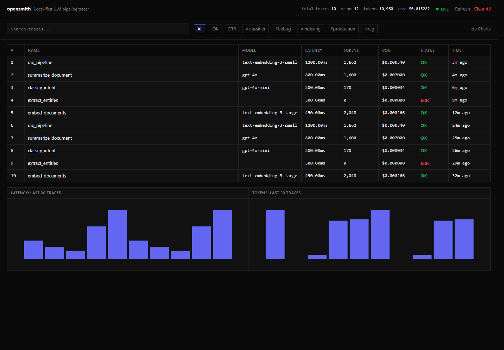

<div align="center">

<pre style="font-family: monospace; font-size: 18px; 
line-height: 1.2; color: #ededec; background: #0a0a0a; 
padding: 20px; display: inline-block;">
 ██████  ██████  ███████ ███    ██ ███████ ███    ███ ██ ████████ ██   ██ 
██    ██ ██   ██ ██      ████   ██ ██      ████  ████ ██    ██    ██   ██ 
██    ██ ██████  █████   ██ ██  ██ ███████ ██ ████ ██ ██    ██    ███████ 
██    ██ ██      ██      ██  ██ ██      ██ ██  ██  ██ ██    ██    ██   ██ 
 ██████  ██      ███████ ██   ████ ███████ ██      ██ ██    ██    ██   ██ 
</pre>

**Local-first LLM pipeline tracer. No cloud. No setup.**


</div>

# opensmith

Local-first LLM pipeline tracer. No cloud. No setup.

## Why opensmith

LangSmith is powerful, but it is built around cloud-hosted tracing and is most natural inside the LangChain ecosystem. opensmith is a local-first alternative: install it with `pip`, use it with any Python LLM pipeline, and inspect traces on your machine without accounts, hosted services, Docker, or configuration. No trace data leaves your machine.

## Install

```bash
pip install opensmith
```

## Quickstart

### Example 1: `@trace` decorator

```python
from opensmith import trace


@trace
def call_llm(prompt: str):
    return openai.chat.completions.create(
        model="gpt-4o-mini",
        messages=[{"role": "user", "content": prompt}],
    )


@trace
def my_pipeline(question: str):
    # search_docs is your own retrieval function
    docs = search_docs(question)
    return call_llm(docs + question)
```

### Example 2: context manager

```python
from opensmith import trace


with trace("my_pipeline") as t:
    t.log("query", query)
    response = openai.chat.completions.create(
        model="gpt-4o-mini",
        messages=[{"role": "user", "content": query}],
    )
    t.log("response", response)
```

### Example 3: `autopatch()` zero code changes

```python
from opensmith import autopatch


autopatch()
```

Patch only selected backends:

```python
from opensmith import autopatch


autopatch(only=["openai"])
```

Patch everything except selected backends:

```python
from opensmith import autopatch


autopatch(exclude=["chromadb"])
```

## Dashboard

```bash
opensmith ui
```

Open `http://localhost:7823`.



## CLI reference

| Command | Description |
| --- | --- |
| `opensmith ui` | Start the local dashboard at `localhost:7823`. |
| `opensmith traces` | List recent traces in the terminal. |
| `opensmith stats` | Show aggregate trace, step, token, and cost statistics. |
| `opensmith clear` | Delete all locally stored traces after confirmation. |

## Supported backends

| Backend | Package | Status |
|---------|---------|--------|
| openai | openai | ✅ |
| anthropic | anthropic | ✅ |
| litellm | litellm | ✅ |
| qdrant | qdrant-client | ✅ |
| chromadb | chromadb | ✅ |
| pinecone | pinecone-client | ✅ |

## Storage

Traces are stored locally at `~/.opensmith/traces.db`.

## License

MIT
